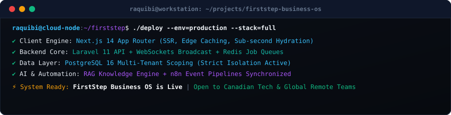
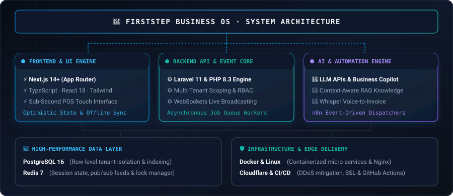
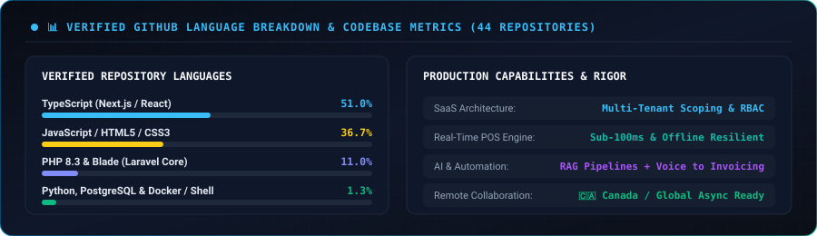

  <!-- Custom Glassmorphic Dark Hero Banner -->
  

    

  <!-- Animated Typing Streamer -->
  

   

  <!-- Quick Navigation Bar -->
  

    <a href="#-flagship-project-firststep-business-os"><strong>[ 🚀 Flagship OS ]</strong></a> &nbsp;•&nbsp;
    <a href="#%EF%B8%8F-engineering-stack"><strong>[ 🛠️ Tech Matrix ]</strong></a> &nbsp;•&nbsp;
    <a href="#-what-i-build"><strong>[ 🧩 System Design ]</strong></a> &nbsp;•&nbsp;
    <a href="#-github-activity--insights"><strong>[ 📊 Activity ]</strong></a> &nbsp;•&nbsp;
    <a href="#-lets-connect"><strong>[ 📬 Contact ]</strong></a>
  

### ⚡ Executive Positioning

I am a **Full-Stack Product Engineer** specializing in architecting and shipping scalable SaaS platforms, business management software, and AI-powered workflow systems.

I don't just write code—I architect complete products, solve mission-critical business bottlenecks, and engineer systems designed to run reliably in production under real-world loads.

 

<!-- Terminal Preview Component -->

  

 

- 🎯 **Product-First Engineering**: Unifying product strategy, database modeling, API contracts, and polished UI into rapid release cycles.
- 🏢 **Multi-Tenant SaaS Architecture**: Deep experience with tenant data isolation, role-based access control (RBAC), multi-currency, and billing lifecycles.
- 🤖 **Applied AI & Automations**: Embedding LLM copilots, context-aware RAG pipelines, and automated event triggers directly into enterprise applications.
- 🌐 **Remote-Ready for Canadian Tech**: Experienced with asynchronous workflows, proactive ownership, rigorous documentation, and fast-paced startup velocity.

### 🛠️ Engineering Stack

A curated, battle-tested technology matrix selected for high performance, maintainability, and developer productivity:

<table>
  <thead>
    <tr bgcolor="#0F172A">
      <th align="left" width="26%">Layer</th>
      <th align="left" width="74%">Technologies &amp; Frameworks</th>
    </tr>
  </thead>
  <tbody>
    <tr>
      <td><strong>Frontend &amp; Client Engine</strong></td>
      <td>
        
        
        
        
        
      </td>
    </tr>
    <tr>
      <td><strong>Backend &amp; Real-Time Core</strong></td>
      <td>
        
        
        
        
        
      </td>
    </tr>
    <tr>
      <td><strong>Data &amp; In-Memory Layer</strong></td>
      <td>
        
        
        
      </td>
    </tr>
    <tr>
      <td><strong>Infra &amp; Cloud Delivery</strong></td>
      <td>
        
        
        
        
        
      </td>
    </tr>
    <tr>
      <td><strong>AI &amp; Event Automation</strong></td>
      <td>
        
        
        
        
        
      </td>
    </tr>
  </tbody>
</table>

### 🧩 What I Build

<table>
  <tr>
    <td width="50%" valign="top">
      <h4>🏢 Multi-Tenant SaaS Platforms</h4>
      <ul>
        <li>Dynamic schema/row-level tenant data isolation</li>
        <li>Granular Role-Based Access Control (RBAC) &amp; permissions</li>
        <li>Usage-based subscription billing &amp; automated invoices</li>
        <li>Comprehensive tenant audit trails &amp; activity logging</li>
      </ul>
    </td>
    <td width="50%" valign="top">
      <h4>🤖 AI Systems &amp; Copilots</h4>
      <ul>
        <li>Context-aware RAG search across business knowledge bases</li>
        <li>Autonomous workflow agents for lead routing &amp; processing</li>
        <li>Voice-to-structured-data generation via OpenAI Whisper</li>
        <li>Cost &amp; latency-optimized prompt architectures</li>
      </ul>
    </td>
  </tr>
  <tr>
    <td valign="top">
      <h4>📊 Business Operations &amp; POS</h4>
      <ul>
        <li>Sub-second touch checkout with offline transaction sync</li>
        <li>Sales CRM pipelines, quotation engines (Devis) &amp; funnels</li>
        <li>Multi-location inventory tracking &amp; barcode scanning</li>
        <li>Compliant invoicing &amp; tax calculations (TVA / ICE)</li>
      </ul>
    </td>
    <td valign="top">
      <h4>⚡ Real-Time &amp; Event Infrastructure</h4>
      <ul>
        <li>Low-latency WebSocket state broadcasting</li>
        <li>Redis pub/sub event bus &amp; distributed locking</li>
        <li>Asynchronous background worker queues with automatic retries</li>
        <li>Idempotent webhook consumers &amp; 3rd-party integrations</li>
      </ul>
    </td>
  </tr>
</table>

### 🚀 Flagship Project: FirstStep Business OS

> **FirstStep Business OS** is a unified, multi-tenant business operating system engineered for SMEs—consolidating Point of Sale (POS), CRM, Inventory Control, Invoicing, Appointments, and AI-driven business intelligence into one cohesive platform.

  

 

#### ⚙️ Key Architectural Modules
- **⚡ High-Throughput POS Terminal**: Engineered for speed and zero-downtime sales, featuring barcode parsing, split payments, optimistic UI, and automatic offline transaction queuing.
- **📈 Sales CRM & Quotation Engine**: Full pipeline visibility, automated PDF quotation (Devis) generation, conversion analytics, and activity timelines.
- **🧾 Automated Invoicing & Facturation**: Full lifecycle invoice generation, credit notes, payment tracking, and compliant tax calculations.
- **📦 Multi-Warehouse Inventory**: Real-time stock alerts, SKU variant matrices, automated purchase orders, and cost-of-goods calculations.
- **🧠 AI Business Copilot**: Integrated LLM assistant that extracts leads from voice notes, drafts proposals, and provides actionable revenue insights.

### 💡 Engineering Principles

- **1. Production-First Rigor** — Code is only complete when it is reliable, observable, secure, and resilient under production traffic.
- **2. Simplicity Over Premature Complexity** — Prioritize well-bounded, modular monoliths and clean interfaces before introducing distributed complexity.
- **3. Defensive & Resilient Design** — Implement idempotent API endpoints, strict database constraints, transaction safety, and graceful fallbacks by default.
- **4. Business Impact Drives Engineering** — Technical decisions must directly serve product velocity, user experience, and measurable business value.
- **5. UX is an Engineering Requirement** — Sub-100ms API responses, optimistic UI updates, zero layout shift, and intuitive error handling are core specs.

### 📡 Currently Building & Focus Areas

- 🟢 **FirstStep Business OS Core**: Multi-tenant database partitioning, real-time POS sync, and tax automation.
- 🔵 **AI Agent Workflows**: Engineering autonomous CRM lead enrichment and automated quotation generation via LLMs.
- 🟣 **Distributed Systems R&D**: Benchmarking PostgreSQL connection pooling and Redis Pub/Sub backpressure handling.

### 📊 GitHub Activity & Insights

  <!-- Native Custom Vector Metrics Card (100% Uptime, Zero External Dependency) -->
  

    

  <!-- Contribution Stream Animation (Local Repository Asset) -->
  
<strong>Contribution Activity Stream</strong>

  
  
<em>Automated daily GitHub contribution stream rendered via GitHub Actions & Platane/snk</em>

### 📝 Engineering Notes & Architecture Perspectives

Practical architectural patterns and production engineering concepts I actively explore and write about:

- 🔹 **Multi-Tenant SaaS Data Isolation**: Shared DB with Tenant Scoping vs. Schema-per-Tenant Tradeoffs
- 🔹 **Building Resilient POS Systems**: Handling Network Drops, Optimistic State, and Reconciliation Queues
- 🔹 **Practical AI in B2B SaaS**: Structuring RAG Workflows, Guardrails, and Cost-Predictable LLM Integrations
- 🔹 **Real-Time Event Broadcasting**: Scaling Laravel WebSockets with Redis Pub/Sub & Worker Queues
- 🔹 **PostgreSQL Performance Optimization**: Indexing strategies, JSONB queries, and connection pooling under load

### 🤝 Let's Connect

I am actively open to discussing **Full-Stack Product Engineering** roles, SaaS architecture, and contract engagements with **Canadian tech startups, scale-ups, and global teams**.

  
  
  
  

 

  © Abderrahmane Raquibi · Engineered with precision, clean code & product focus.

